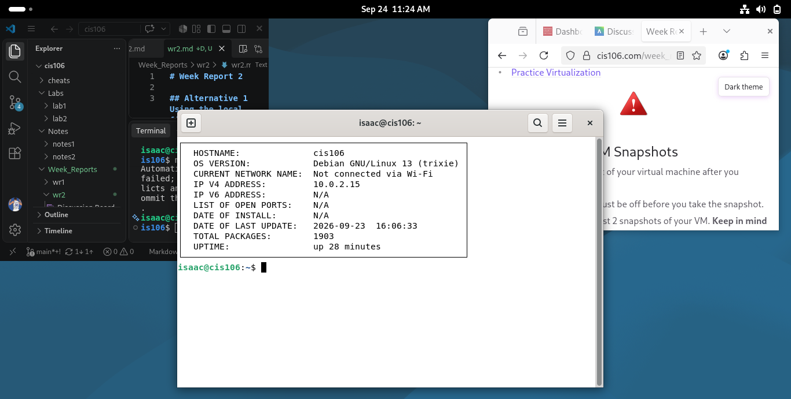

# Week Report 2

## Alternative 1 Using the local file path
 * [Notes 2](../../Notes/notes2/notes2.md)
 * [lab 2](../../Labs/lab2/lab2.md)

## Alternative 2 Using the github url
 * [Notes 2](https://github.com/slumpisaac/cis106/blob/main/Notes/notes2/notes2.md)
 * [lab 2](https://github.com/slumpisaac/cis106/blob/main/Labs/lab2/lab2.md)

## Debian Desktop

## Discussion Board
